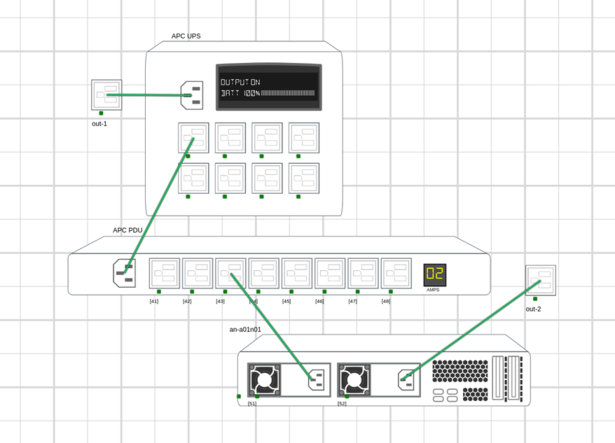
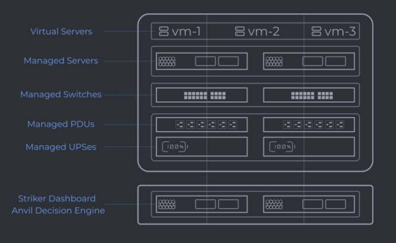
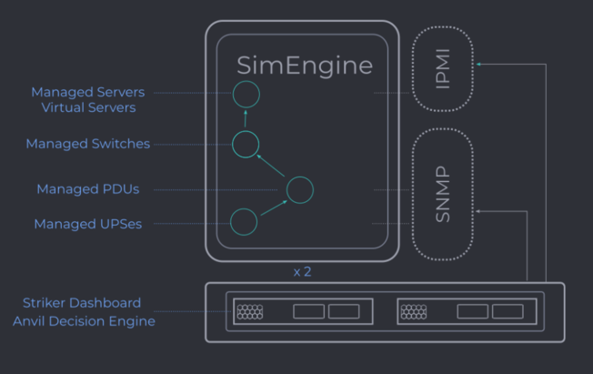

# Sim Engine

SimEngine is a hardware simulation engine that can model [Alteeve’s](https://www.alteeve.com/c/) Anvil! Intelligent Availability platform and similar high-availability setups.

The engine can reconstruct behaviour of system’s core components such as PDUs, UPSes & servers (running the VMs). PDUs and UPSes support SNMP interface, server-type assets can be set up with an optional IPMI simulator and/or storcli64 simulator.

The project exposes core assets’ functionalities through both CLI and UI, although dashboard utilizes only a limited set of power-related features at the moment.

SimEngine features include:

- System modelling & power connections (PDU, UPS, Servers & VM control)
- Power events (wallpower, assets' states, UPS battery etc)
- IPMI/BMC interface and SNMP simulation (including load & power behaviour)
- Thermal simulation (AC & Ambient, temperature sensors)
- storcli64 simulation (Drive/CacheVault failure, temperature behaviour etc.)

### Getting Started

[Installation](./Installation) page provides a guide for the platform set-up. You can model your own hardware topology (see [System Modelling](./System%20Modeling)) or check a real-world high-availability system example (see [Anvil Model](./Anvil%20Model));

### Developing for SimEngine

[Installation](./Installation/#development-version) page includes steps on how to run this app in a development mode. SimEngine is pretty much restricted to CentOS-based platforms (it is suggested you use the latest Fedora systems as we test/develop on Fedora), however, it should run just as fine on any other linux-based OS.

Make sure you read our [contributing guidelines](https://github.com/Seneca-CDOT/simengine/blob/master/CONTRIBUTING.md) before proposing some exciting changes!

## Project Overview (in-depth)

SimEngine was designed to reconstruct Alteeve's digital infrastructure [Anvil!](https://www.alteeve.com/w/What_is_an_Anvil!_and_why_do_I_care%3F) and simulate common hardware scenarios such as hard drive failures, power outages and overheating. The overall goal of this project is to 'deceive' Anvil! into thinking it is dealing with some real hardware thus eliminating bulky & expensive devices from the development and testing processes.

The Anvil! Platform developed by [Alteeve's Niche!](https://www.alteeve.com/) improves upon traditional approaches to high-availability by making autonomous intelligent decisions and offering complete redundancy with a unique and specific arrangement of hardware devices.

Alteeve’s infrastructure is comprised of two management servers called Striker, two UPSes, two PDU’s, two Switches, and two sets
of Nodes running client's VMs (whatever servers/services you might want to protect). One of the objectives of SimEngine project is to accurately recreate behaviour of core hardware assets and simulate their power connections.

To draw a meaningful conclusion from the state of the system, Anvil's agents collect all sorts of data from its devices including:

*  Battery level of the UPSes
*  Load on PDUs & UPSes
*  States of RAID arrays in a server
*  Whether a particular device is up & running
*  ..And all sorts of other things

This information is exposed by hardware itself through either SNMP interface for assets like Switches, PDUs, UPSes, or through IPMI interface for nodes supporting a [BMC chip](https://www.servethehome.com/explaining-the-baseboard-management-controller-or-bmc-in-servers/).

Hardware data produced by the simulation engine is exposed through IPMI & SNMP interfaces the same way real physical components present their states. SimEngine is using 3rd party packages for its network simulations including [OpenIPMI's](https://sourceforge.net/projects/openipmi/) lanserv and [snmpsim](http://snmplabs.com/snmpsim/simulating-agents.html) tool for SNMP interface.

Anvil's hardware, for which we use term 'Assets', is stored internally as a graph where each node can be powered by another node (or multiple nodes in some cases). This allows engine to accept complex and diverse arrangements of assets not limited to Alteeve's system layout. The power connections between nodes are used to infer power/load behaviour within the system and determine 'flow' of power events (such as voltage spikes/drops, power outages etc.).

In addition to that, this project supports both web-based management dashboard as well as a set of command line tools aimed to automate continuous testing.

### App's Architecture

This section presents an overview of core software components of SimEngine with some diagrams loosely following [C4 approach](https://c4model.com).

At a high level, there are 2 major systems involved – SimEngine (simulation system) and Alteeve's Anvil. A system tester can use SimEngine interfaces (cli or the dashboard) to trigger certain events, such as power outages, drive failures etc. A new system state will be calculated and made available to Anvil. Anvil's decision-making component will process it, determine health of the nodes and initiate server migrations if needed. The end result can be used by a system tester to facilitate quality assurance of both their digital infrastructure and Anvil software.

